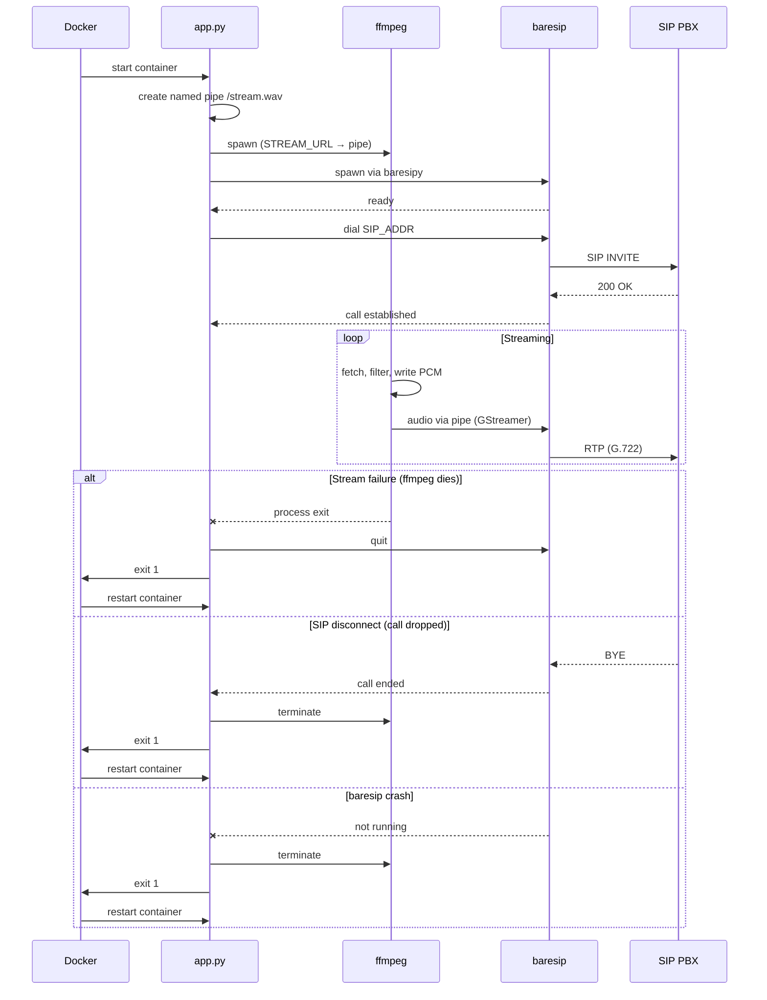

# sip-streamer

A Docker container that dials into a SIP conference and streams audio from an HTTP source. Built on [baresip](https://github.com/baresip/baresip) 4.6 with GStreamer for audio playback.

## Quick start

```yaml
# docker-compose.yml
services:
  sip-streamer:
    build: sip-streamer
    restart: always
    environment:
      SIP_ID: "streamer@pbx.example.com"
      SIP_ADDR: "conference@pbx.example.com"
      STREAM_URL: "https://example.com/stream.mp3"
```

```sh
docker compose up -d
```

## Environment variables

| Variable | Description |
|---|---|
| `SIP_ID` | SIP identity (`user@host`). Used for the From header. |
| `SIP_ADDR` | SIP destination to dial (e.g. `1#100*1234@pbx`). |
| `STREAM_URL` | Audio source URL. Any format ffmpeg can decode (MP3, AAC, Ogg, HLS, etc.). |

## How it works

1. **ffmpeg** fetches audio from `STREAM_URL`, applies compression/normalization filters, and writes PCM into a named pipe.
2. **baresip** reads from the pipe via GStreamer, dials `SIP_ADDR`, and sends the audio into the call.
3. If ffmpeg dies, the call drops, or baresip crashes, the process exits and Docker `restart: always` brings it back.

Audio codecs in priority order: G.722 (16 kHz wideband), Opus, G.711.



## Testing

Start the test environment (Asterisk PBX + sip-streamer):

```sh
cd tests
docker compose up --build -d
```

Listen to the conference audio from your Mac:

```sh
brew install baresip
baresip -e '/uanew <sip:listener@localhost>;regint=0' -e 'u' -e 'd sip:1#100*1234@localhost'
```

Run the automated restart tests:

```sh
cd tests
./test-restart.sh
```

## Building

```sh
docker build -t sip-streamer sip-streamer/
```

The Dockerfile uses a multi-stage build: libre and baresip 4.6 are compiled from source in a builder stage, then copied into a slim Debian trixie runtime image.
